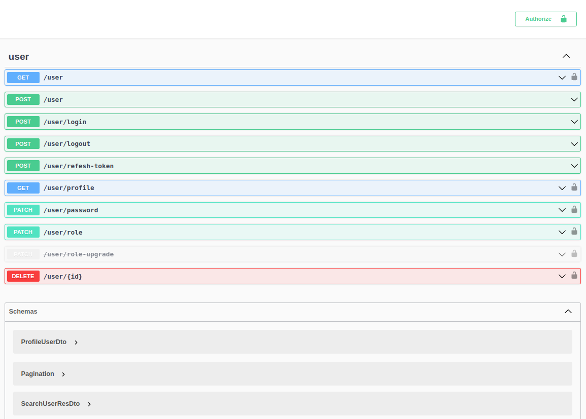

# Nestjs Authentication

Nestjs authentication template

## Description

This project for base authentication

## Features

- Register user

- Login

- Get profile

- Roles

- Refresh token

- Change password

- Delete account

## Technology used

- Nestjs

- Swagger

- Mongodb

- Redis

- Passport

- JWT

- class-validator

## Installation

```bash
$ npm install
```

## Running the app

```bash
# development
$ npm run start

# watch mode
$ npm run start:dev

# production mode
$ npm run start:prod
```

Document api: [http://localhost:3000/docs](http://localhost:3000/docs)

## Running with docker-compose

```bash
docker-compose up --build
```

Document api: [http://10.10.10.2/docs](http://10.10.10.2/docs)

Authentication docs: `tanmv/MVT@2022`

## Test

```bash
# unit tests
$ npm run test

# e2e tests
$ npm run test:e2e

# test coverage
$ npm run test:cov
```

## Screenshot



## Author

Email: [macvantan@gmail.com](mailto:macvantan@gmail.com)

Fb: [fb/mvt.hp.star](https://www.facebook.com/mvt.hp.star)

Skype: [trai_12a1](skype:trai_12a1?chat)